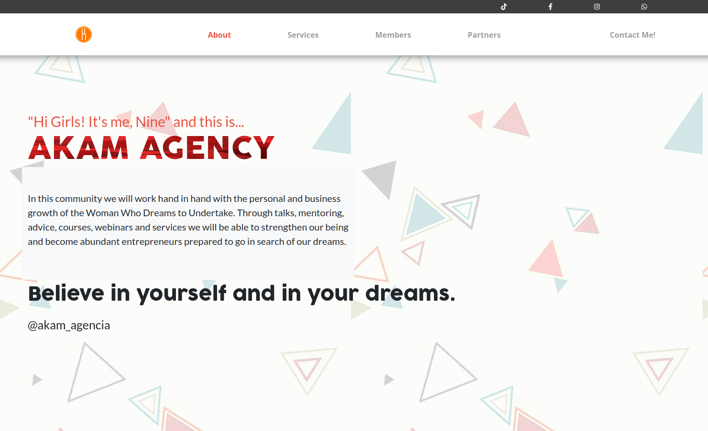
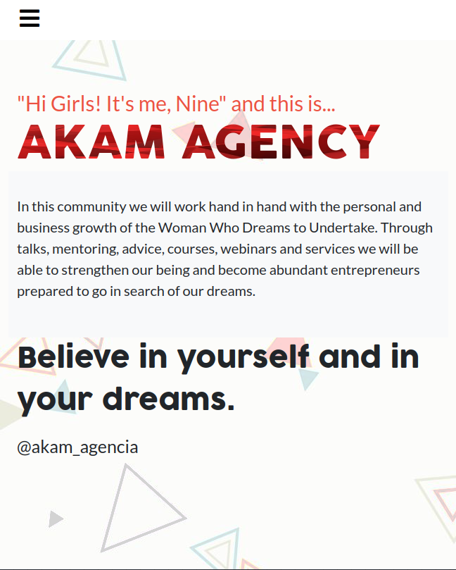

# AKAM Agency

> This project is the first project of the AKAM Agency.

### Desktop version View

### Mobile Version View

This page is created in order to give the entrepeneaur project of my wife,
a face to the world. I hope you enjoy it. It's a work in progress so please, 
feel free to contact me if you have any questions or suggestions.

## Built With

- HTML5
- CSS3
- Bootstrap
- Font Awesome

## Live Demo

[Live Demo Link](https://livedemo.com)

## Getting Started

To get a local copy up and running follow these simple example steps:

- Select the link with the code on the https code tab in the repo.
- Open a Terminal and write the command: git clone "TheLinkWithCode".
- Drag the index.html to any browser.

## Authors

👤 **Luis Abarca**

- GitHub: [@TheLuisAbarca](https://github.com/TheLuisAbarca)

## 🤝 Contributing

Contributions, issues, and feature requests are welcome!

Feel free to check the [issues page](../../issues/).

## Show your support

Give a ⭐️ if you like this project!

## Acknowledgments

Original design idea by Cindy Shin in [Behance](https://www.behance.net/adagio07).

## 📝 License

This project is [MIT](./MIT.md) licensed.
